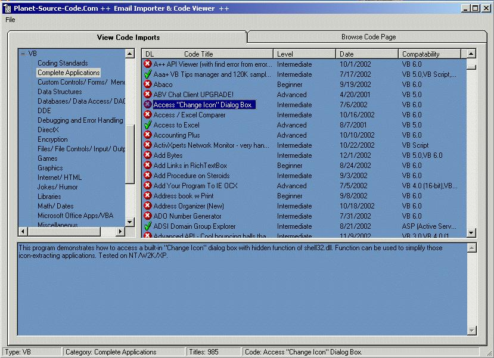



## Import\_PSC

### Description

Import PSC text emails into an Access database. View code by type and category. Also downloads the zip files and views code that isnt zipped. If you make any improvements to this code, I would like to see it posted on PSC. 

Please Note - This will only work with MS Outlook, and with PSC emails that are text-only. Modify the GetInboxItems() sub in frmImport to fit your needs. 

A good bit of the code isnt mine, the authors names are left in the code where there were any. Vote for it if you want, but if you would rather buy me a beer, that would be fine too.
 
### More Info
 
This will only work with MS Outlook, and with PSC emails that are text-only. Please modify the GetInboxItems() sub in frmImport to fit your needs.

             |
---                |---
**Submitted On**   |2003-02-14 22:54:16
**By**             |[Magoo2](https://github.com/Planet-Source-Code/PSCIndex/blob/master/ByAuthor/magoo2.md)
**Level**          |Intermediate
**User Rating**    |4.5 (18 globes from 4 users)
**Compatibility**  |VB 5\.0, VB 6\.0
**Category**       |[Complete Applications](https://github.com/Planet-Source-Code/PSCIndex/blob/master/ByCategory/complete-applications__1-27.md)
**World**          |[Visual Basic](https://github.com/Planet-Source-Code/PSCIndex/blob/master/ByWorld/visual-basic.md)
**Archive File**   |[Import\_PSC1544412142003\.zip](https://github.com/Planet-Source-Code/magoo2-import-psc__1-42520/archive/master.zip)

